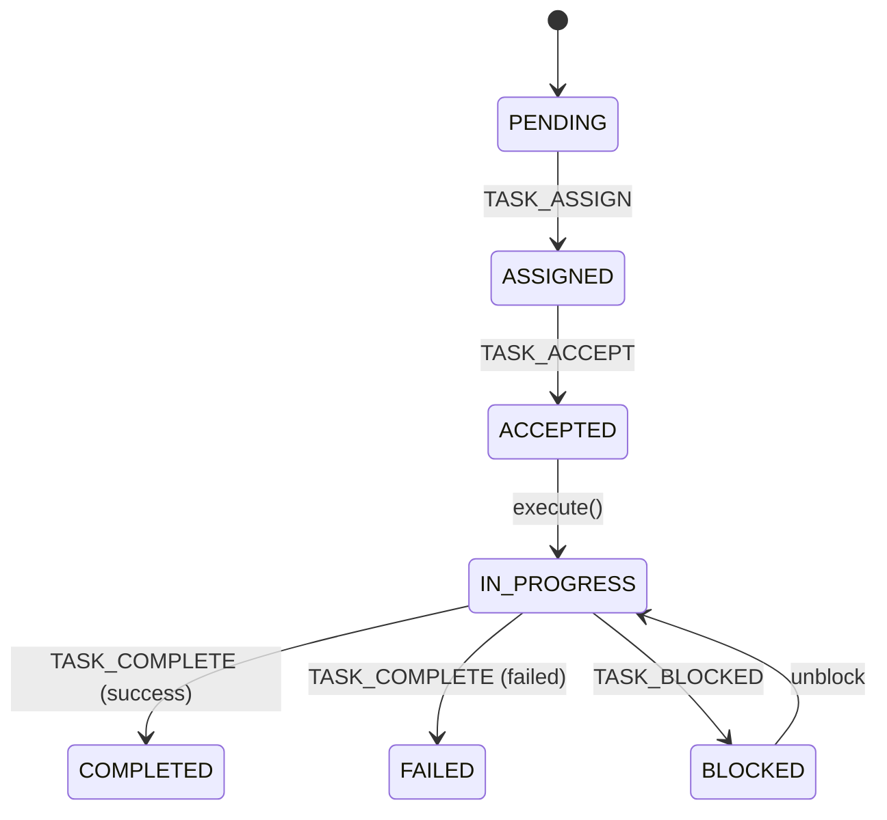
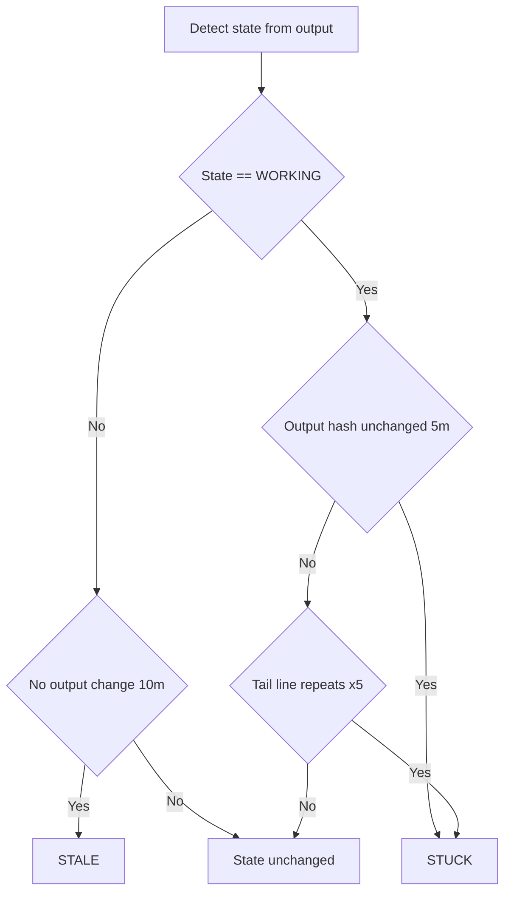

# Team Protocol

The Team Protocol is the multi-agent orchestration layer for zeos. It coordinates Directors and Workers using a shared relay, task lifecycle, and heartbeat-driven liveness signals.

## Roles
- **Director**: Decomposes tasks, assigns workers, tracks progress and health.
- **Workers**: Receive assignments, execute tasks, emit heartbeats, report completion or blockers.

## Task Lifecycle



## Message Types (Hive)
- `TASK_ASSIGN`: Director dispatches a task payload.
- `TASK_ACCEPT`: Worker acknowledges and returns ETA.
- `TASK_COMPLETE`: Worker reports result (success or failure).
- `TASK_BLOCKED`: Worker reports dependencies or blockers.
- `HEARTBEAT`: Worker emits liveness/progress during execution.

## Heartbeat Protocol (Coordination Multiplier)

**Objective:** Provide lightweight liveness and progress signals without flooding the relay.

**Heartbeat cadence**
- Default interval: 60s
- Task-aware interval: when `expected_duration_sec > 300`, use sparse heartbeat (e.g., 300s)

**Heartbeat payload (example)**
```json
{
  "worker": "codex-2",
  "task_id": "abc-123",
  "status": "working",
  "beat": 3,
  "interval_sec": 60,
  "expected_duration_sec": 900,
  "timestamp": "2026-01-24T01:49:14Z",
  "progress": null,
  "action": "heartbeat",
  "terminal_hash": "a3f2b1c9"
}
```

**Worker behavior**
- Start heartbeat loop after `TASK_ACCEPT`.
- Run heartbeat loop in a background thread; never block task execution.
- Stop heartbeat loop on task completion or shutdown.

## Frozen and Loop Detection

**Definitions**
- `STUCK`: Agent is WORKING but output hash is unchanged for 5 minutes.
- `STALE`: No output change for 10 minutes (possible crash or silent lock).
- `LOOP`: Output tail repeats the same line 5 times.

**Algorithm (StateDetector)**
1. Capture last 20 lines and compute a hash.
2. If hash unchanged for 5 minutes while WORKING -> `STUCK`.
3. If no output changes for 10 minutes -> `STALE`.
4. If last 5 non-empty lines are identical -> `STUCK` (loop).



## Observation Mode (Token Discipline)
- Directors should **subscribe to HEARTBEAT** messages and only call `detect_state` or `get_agent_output` when heartbeats are late (interval * 1.5).
- Direct polling of the relay must not exceed once every 30 seconds; long-polling via `subscribe` is preferred.

## Team Isolation & Security (v1.1)

The Overseer Hive enforces **Strict Team Isolation** to prevent inter-team interference.

*   **Team Identity:** Derived from the tmux session suffix (e.g., `claude-3` = Team 3).
*   **Mandatory requesting_agent:** Every call to `get_messages`, `subscribe`, and `get_worker_heartbeats` **REQUIRES** the `requesting_agent` parameter.
*   **Logical Partitioning:** The relay database strictly filters by `team_id`. Agents cannot see or interact with messages belonging to other teams.
*   **Relay Hygiene:** Messages have a 24-hour TTL. Legacy or unassigned records (NULL `team_id`) are auto-purged on startup to ensure zero data leakage.

## Communication Governance (Mandatory)

To ensure reliable inter-agent coordination and minimize token waste, all agents MUST follow these rules when sending commands via `send_to_agent`:

1.  **Busy Check**: Before sending a command, the sender MUST call `detect_state(agent)` to verify the target is `IDLE`.
2.  **Interrupt Protocol**: If the target agent is `WORKING` and an urgent interrupt is required, set `interrupt_if_busy=True`.
3.  **The Two-Step Execution Rule**: Commands sent via `send_to_agent` MUST be executed using two separate tool calls:
    *   **Step 1:** `send_to_agent(agent, message="command")` (Types the command).
    *   **Step 2:** `send_to_agent(agent, message="")` (Sends the explicit **Enter/C-m**).
    *   *Mechanism:* The server appends an "Enter" key after the message. The second call with an empty message sends a lone "Enter" to execute the previously typed command.
4.  **Verification**: After sending, verify receipt using `get_agent_output`. Never assume execution.
5.  **Polling Frequency**: Direct polling of the relay MUST NOT exceed once every 30 seconds. Use `subscribe` for event-driven updates.

## Security
- SAFE_MODE: Prevents non-whitelisted commands (rm, etc.).
- Rate Limiting: Throttles message frequency to prevent infinite loops.
