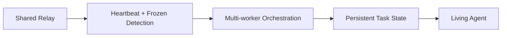

# Limitations and Future Work

This document captures current constraints and the roadmap toward a "Living Agent" system.

## Current Limitations

1. **Single-node relay**
   - SQLite `relay.db` is local to one host. No multi-host replication.

2. **No auth / access control**
   - Any local process with DB access can read/write messages.

3. **Heuristic state detection**
   - StateDetector depends on terminal patterns. False positives remain possible.

4. **Limited observability**
   - No metrics, tracing, or external health dashboards.

5. **No retention policy**
   - Relay grows unbounded without cleanup.

6. **MCP availability risk**
   - If MCP is down, tools are unavailable (requires direct SQLite access).

7. **Polling fallback still exists**
   - Long-poll is preferred but some flows still poll at fixed intervals.

8. **Task governance is soft**
   - No enforcement of SLA, retry policy, or worker concurrency limits.

## Future Work

### Near-Term (Stability)
- **Retention policy** for relay messages (time/size based).
- **Health dashboard** for heartbeats and stuck detection.
- **Configurable thresholds** (heartbeat interval, stuck/stale windows).
- **MCP resilience**: auto-restart, explicit health probe, startup diagnostics.

### Mid-Term (Scale)
- **Distributed relay** (Postgres/Redis or message bus)
- **Auth and identity** (signed worker IDs, scoped permissions)
- **Event-driven subscriptions** with filter-by-type and filter-by-agent

### Long-Term (Living Agent)
The "Living Agent" goal is a persistent, self-healing worker that can recover state, continue tasks, and coordinate across the fleet.

Key capabilities:
- **State continuity**: task journaling + resumable execution
- **Self-healing**: detect loops/crashes and restart with safe rollback
- **Memory**: durable context store and retrieval for long-running missions
- **Governed autonomy**: cost budgets, approvals, risk tiers

## Strategic Bottlenecks to Resolve
- **Reliability**: MCP instability and local-only relay
- **Security**: missing auth and auditability
- **Scalability**: single-host limits, no sharding
- **Truth**: lack of deterministic task state beyond heuristics

## Proposed Research Threads
- Deterministic task progress checkpoints (machine-readable)
- Worker reputation and trust scoring
- Semantic summarization of task output for director consumption
